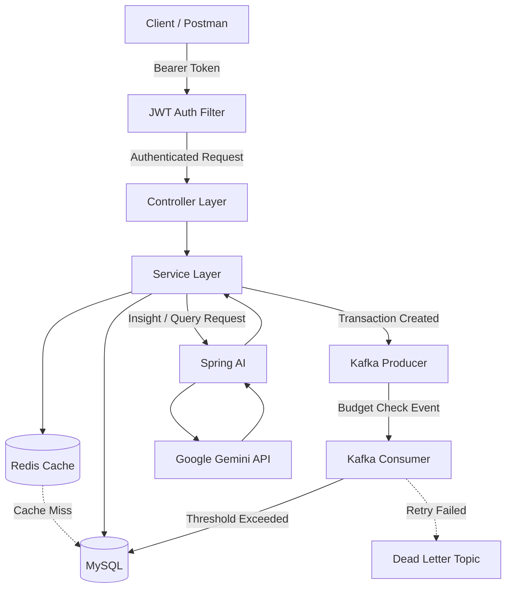

# SmartSpend 💰


> A secure, event-driven personal finance tracker REST API with AI-powered spending insights and live budget Q&A via function calling.

## 📖 About

SmartSpend is a backend REST API that helps users track income, expenses, and budgets. It automatically alerts users when they're approaching their budget limits, and uses AI to generate monthly spending insights and answer natural-language questions about their finances.

## ✨ Key Features

- 🔐 **JWT-based authentication** with IDOR-safe design — user identity derived from token, never from client-supplied IDs
- ⚡ **Redis caching** with custom TTL and cache eviction to reduce redundant database reads
- 📨 **Event-driven budget alerts** via Apache Kafka, with retry/backoff and Dead Letter Topic handling for failed messages
- 🤖 **AI-powered insights** using Google Gemini (Spring AI) — structured monthly spending summaries and live budget Q&A via function/tool calling
- 📄 **Fully documented REST API** via Swagger/OpenAPI with JWT Bearer auth support
- 🛡️ **Layered architecture** (Controller-Service-Repository) with DTO-based request/response separation

## 🛠️ Tech Stack

| Category | Technology |
|---|---|
| Language | Java 21 |
| Framework | Spring Boot 3.5.15 |
| Security | Spring Security, JWT (jjwt) |
| Database | MySQL 8, Spring Data JPA |
| Caching | Redis |
| Messaging | Apache Kafka |
| AI | Spring AI, Google Gemini (gemini-2.5-flash) |
| API Docs | Swagger / OpenAPI (springdoc-openapi) |
| Containerization | Docker |

## 🏗️ Architecture



## 📚 API Documentation

Full interactive API docs available via Swagger UI once the app is running:

http://localhost:8080/swagger-ui/index.html

### Sample Request — Register User

```http
POST /api/users/register
Content-Type: application/json

{
  "name": "John Doe",
  "email": "john@example.com",
  "password": "SecurePass123"
}
```

## 🚀 Getting Started

### Prerequisites
- Java 21
- MySQL 8 (installed locally)
- Docker & Docker Compose (for Redis & Kafka)
- Maven

### Installation

1. Clone the repository
```bash
git clone https://github.com/RajputHarshit/smartspend.git
cd smartspend
```

2. Start Redis & Kafka via Docker Compose
```bash
docker-compose up -d
```

3. Configure application properties
```bash
copy src\main\resources\application-example.properties src\main\resources\application.properties
```
Then update `application.properties` with your MySQL credentials, JWT secret, and Gemini API key.

4. Run the application
```bash
./mvnw spring-boot:run
```

The API will be available at `http://localhost:8080`

## 🔮 Future Improvements

- Unit & integration tests (JUnit + Mockito)
- Global exception handling refinement
- Pagination on list endpoints
- Full application Dockerization (currently only Redis & Kafka are containerized)